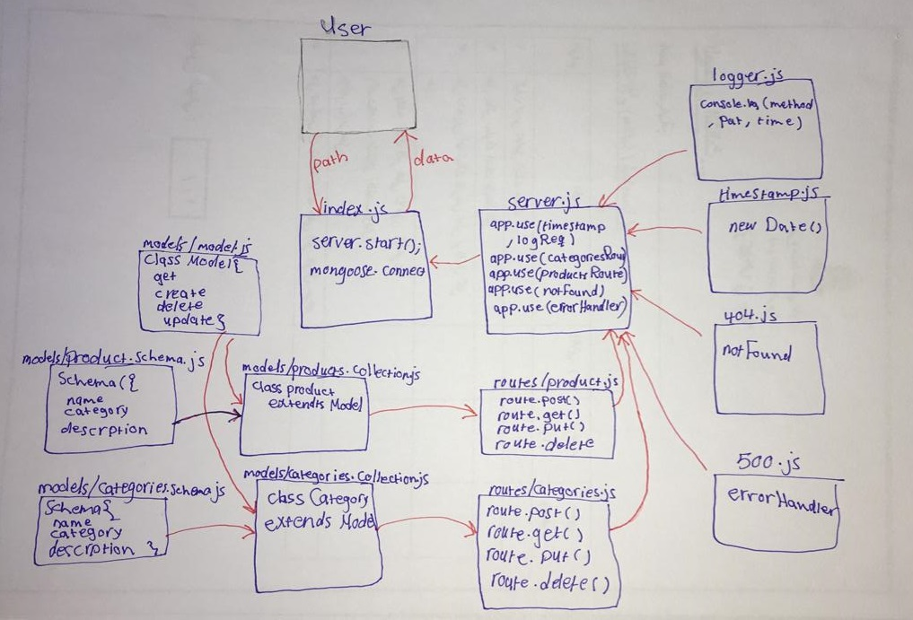

# api-server7

## lab 07

- [pull request](https://github.com/sondos-401-advanced-javascript/api-server7/pull/2)
- [github action](https://github.com/sondos-401-advanced-javascript/api-server7/actions)
- [swagger doc](https://app.swaggerhub.com/apis/sondoshassan/lab8-realApi/0.1)

### test
by using `npm test`
and `npm run lint`

### End Point 
- /categories (GET)all, (POST)
- /categories/:id (GET)byId, (PUT), (DELETE)
- /products (GET)all, (POST)
- /products/:id (GET)byId, (PUT), (DELETE)

### UML
